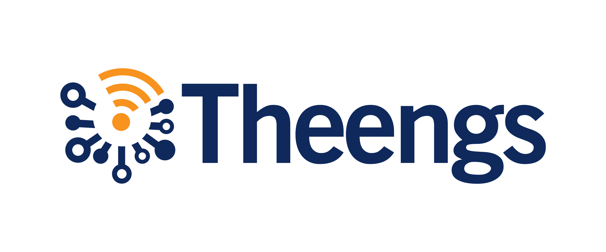

**Theengs app** is a multi platforms, multi devices application and BLE application that leverage the [Theengs Decoder library](https://github.com/theengs/decoder).
It retrieves data from a wide range of [BLE sensors](prerequisites/devices); LYWSD03MMC, CGD1, CGP1W, H5072, H5075, H5102, TH1, TH2, BBQ, CGH1, CGDK2, CGPR1, RuuviTag, WS02, WS08, TPMS, MiScale, LYWSD02, LYWSDCGQ, MiFlora... and enables to read the advertised data from these sensors. It also translates these informations into a readable JSON format and push those to an MQTT broker if you need.

The app uses the bluetooth component of your Android Phone, Windows desktop, Apple desktop, Linux desktop, laptop or server.

**Theengs app** can be used as a standalone solution or as a complementary solution to [OpenMQTTGateway](https://docs.openmqttgateway.com/) and/or [Theengs gateway](https://gateway.theengs.io) if you want a continuously running gateway.

The app will retrieve data from BLE sensors from Govee, Xiaomi, Inkbird, QingPing, ThermoBeacon, ClearGrass, Blue Maestro and many more.

#### Third party projects used by Theengs

* [Qt](https://www.qt.io) ([LGPL 3](https://www.gnu.org/licenses/lgpl-3.0.txt))
* [QtMqtt](https://www.qt.io) ([GPL 3](https://www.gnu.org/licenses/gpl-3.0.txt))
* [StatusBar](https://github.com/jpnurmi/statusbar) ([MIT](https://opensource.org/licenses/MIT))
* [ekkesSHAREexample](https://github.com/ekke/ekkesSHAREexample) ([license](https://github.com/ekke/ekkesSHAREexample/blob/master/LICENSE))
* [SingleApplication](https://github.com/itay-grudev/SingleApplication) ([MIT](https://opensource.org/licenses/MIT))
* RC4 code from Christophe Devine ([GPL 2](https://www.gnu.org/licenses/old-licenses/gpl-2.0.txt))
* Graphical resources: [assets/COPYING](assets/COPYING)
