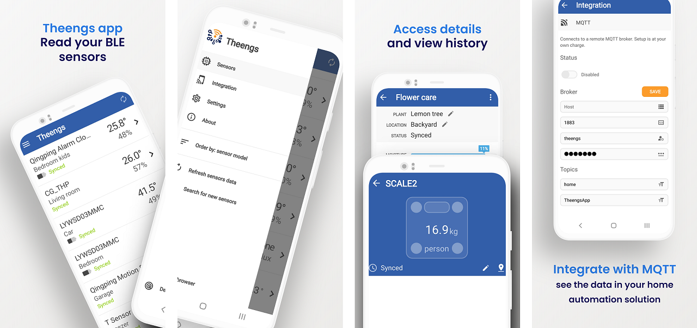

**Theengs app** is a multi platforms, multi devices application and BLE to MQTT gateway that leverages the [Theengs Decoder library](https://github.com/theengs/decoder).
It retrieves data from a wide range of [BLE sensors](prerequisites/devices); LYWSD03MMC, CGD1, CGP1W, H5072, H5075, H5102, TH1, TH2, BBQ, CGH1, CGDK2, CGPR1, RuuviTag, WS02, WS08, TPMS, MiScale, LYWSD02, LYWSDCGQ, MiFlora... and enables to read the advertised data from these sensors. It also translates this information into a readable JSON format and pushes those to an MQTT broker if you need.

The app uses the bluetooth component of your Android Phone to read the sensor data.

**Theengs app** can be used as a standalone solution or as a complementary solution to [OpenMQTTGateway](https://docs.openmqttgateway.com/) and/or [Theengs gateway](https://gateway.theengs.io) if you want a continuously running gateway.

The app will retrieve data from BLE sensors from Govee, Xiaomi, Inkbird, QingPing, ThermoBeacon, ClearGrass, Blue Maestro and many more.

For more information view the [documentation](https://app.theengs.io/)

*Google Play and the Google Play logo are trademarks of Google LLC.*

#### Third party projects used by Theengs app

* [Qt](https://www.qt.io) ([LGPL 3](https://www.gnu.org/licenses/lgpl-3.0.txt))
* [QtMqtt](https://www.qt.io) ([GPL 3](https://www.gnu.org/licenses/gpl-3.0.txt))
* [StatusBar](https://github.com/jpnurmi/statusbar) ([MIT](https://opensource.org/licenses/MIT))
* [ekkesSHAREexample](https://github.com/ekke/ekkesSHAREexample) ([license](https://github.com/ekke/ekkesSHAREexample/blob/master/LICENSE))
* [SingleApplication](https://github.com/itay-grudev/SingleApplication) ([MIT](https://opensource.org/licenses/MIT))
* RC4 code from Christophe Devine ([GPL 2](https://www.gnu.org/licenses/old-licenses/gpl-2.0.txt))
* Graphical resources: [assets/COPYING](assets/COPYING)
