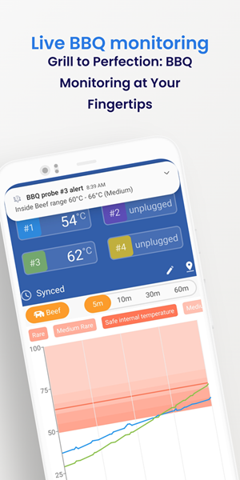

# Theengs BLE mobile application

## 🌟 Local Smart Sensor Integration 🌟

Theengs App seamlessly reads a wide array of Bluetooth Low Energy (BLE) sensors, gathering real-time data on environmental parameters such as temperature, humidity, moisture, etc. It displays these readings intuitively and enables integration with your Smart Home setup via MQTT. Compatible with platforms like Home Assistant, Theengs App is a vendor-agnostic reader of [your sensors](https://decoder.theengs.io/devices/devices.html).

## 🔥 Elevate Your Grilling Game

Theengs App now offers a dedicated live monitoring feature for BBQ enthusiasts. Track your cooking with a dynamic chart that displays temperature trends in real time. Set personalized thresholds for different cooking stages and receive instant notifications based on these criteria. Whether you prefer your meat rare, medium, or well-done, Theengs App ensures your grilling is done to perfection.

## 🔒Respecting Your Privacy
With Theengs App, your data stays local by default. For more details, please refer to our [privacy policy](https://app.theengs.io/use/privacy.html).

## 🏡 Take control with Smart Home Integration
Theengs App syncs with platforms like Home Assistant via MQTT. Record sensor data on your preferred server - your home, your choice.

## 📲 Choose Your Platform and Download Now

 
 

::: tip Note
The Theengs app reads data that is 'broadcasted' by devices, operating primarily in a passive mode without direct connections, except for Mi Flora and ThermoBeacon, where historical data is accessed through a connection. For all other devices, the app captures data as it is emitted by the sensors.

BBQ Live monitoring and notifications require the app to be active on the sensor screen.
:::

### Features comparison between Operating Systems
| OS | Real time data | BBQ monitoring |MQTT integration | Running in background | Home Assistant Auto Discovery |
|:-:|:-:|:-:|:-:|:-:|:-:|
|iOS|☑️|☑️|☑️||☑️|
|Android|☑️|☑️|☑️|☑️ *experimental*|☑️|

**Theengs app** can be used as a standalone solution or as a complementary solution to [OpenMQTTGateway](https://docs.openmqttgateway.com/) and/or [Theengs gateway](https://gateway.theengs.io) if you want a continuously running gateway.

### Third party projects used by Theengs app

* [Qt](https://www.qt.io) ([LGPL 3](https://www.gnu.org/licenses/lgpl-3.0.txt))
* [QtMqtt](https://www.qt.io) ([GPL 3](https://www.gnu.org/licenses/gpl-3.0.txt))
* [Arduino Json](https://arduinojson.org/) ([MIT](https://opensource.org/licenses/MIT))
* [Decoder](https://decoder.theengs.io/) ([GPL 3](https://www.gnu.org/licenses/gpl-3.0.txt))
* [StatusBar](https://github.com/jpnurmi/statusbar) ([MIT](https://opensource.org/licenses/MIT))
* [ekkesSHAREexample](https://github.com/ekke/ekkesSHAREexample) ([license](https://github.com/ekke/ekkesSHAREexample/blob/master/LICENSE))
* [SingleApplication](https://github.com/itay-grudev/SingleApplication) ([MIT](https://opensource.org/licenses/MIT))
* RC4 code from Christophe Devine ([GPL 2](https://www.gnu.org/licenses/old-licenses/gpl-2.0.txt))
* Graphical resources: [assets/COPYING](assets/COPYING)

### Acknowledgements

*App Store and Apple logo are registered trademarks of Apple Inc.*

*Google Play and the Google Play logo are trademarks of Google LLC.*

::: warning Note
All product and company names are trademarks or registered trademarks of their respective holders. Use of them does not imply any affiliation with or endorsement by them.
:::

::: slot footer
[GPLv3 Licensed](https://github.com/theengs/home/blob/main/LICENSE) | Copyright © 2024 Theengs
:::
