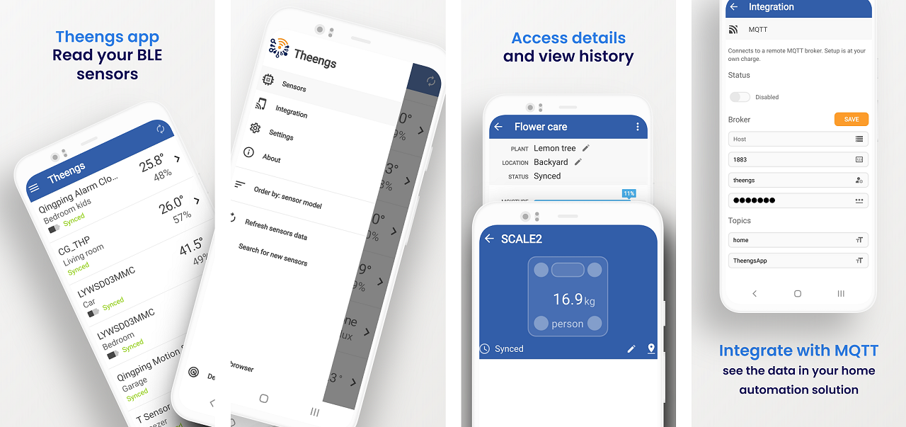
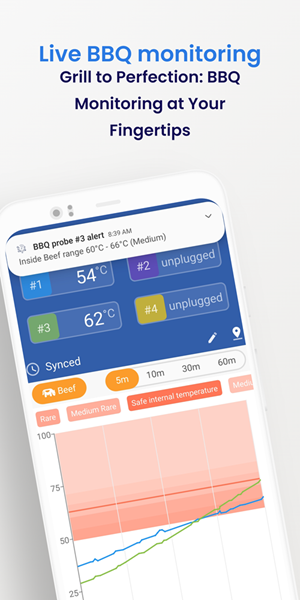

# Theengs BLE mobile application

## 🌟 Local Smart Sensor Integration 🌟

Theengs App seamlessly reads a wide array of Bluetooth Low Energy (BLE) sensors, gathering real-time data on environmental parameters such as temperature, humidity, moisture, soil, battery voltage, BBQ probes, motion, and more. It can also **control SwitchBot actuators** (Bot S1, Curtain, Blind Tilt) directly over BLE. Readings are displayed intuitively and can be integrated with your Smart Home setup via MQTT (plaintext or TLS, with Home Assistant auto-discovery). Compatible with platforms like Home Assistant, Theengs App is a vendor-agnostic reader of [your sensors](https://decoder.theengs.io/devices/devices.html).

## 🤖 Control Your SwitchBot Devices

Theengs App goes beyond reading sensors: it can **control SwitchBot actuators** directly over Bluetooth. Open, close or tilt a SwitchBot Curtain or Blind Tilt from the app, or trigger a SwitchBot Bot S1 in Press or Switch mode. The app pairs to the device on demand for each action, then releases the connection, keeping things local and private.

Supported SwitchBot devices:

* **Bot S1 / SmartSwitch** — On, Off, Push-Pull, with Press / Switch mode and inverted-direction option
* **Curtain 2 / Curtain 3** — Open, Close, Stop, move to position (0–100 %), High / Low speed
* **Blind Tilt** — Open, Close up, Close down, Stop, tilt to position (-100…100 %)

## 🔥 Elevate Your Grilling Game

Theengs App now offers a dedicated live monitoring feature for BBQ enthusiasts. Track your cooking with a dynamic chart that displays temperature trends in real time. Set personalized thresholds for different cooking stages and receive instant notifications based on these criteria. Whether you prefer your meat rare, medium, or well-done, Theengs App ensures your grilling is done to perfection.

## 🔒Respecting Your Privacy
With Theengs App, your data stays local by default. For more details, please refer to our [privacy policy](https://app.theengs.io/use/privacy.html).

## 🏡 Take control with Smart Home Integration
Theengs App syncs with platforms like Home Assistant via MQTT. Record sensor data on your preferred server - your home, your choice.

## 📲 Choose Your Platform and Download Now

 
 

::: tip Note
The Theengs app reads data that is 'broadcasted' by devices, operating primarily in a passive mode for most sensors — the app captures data as it is emitted, without any direct connection. A direct BLE connection is opened on demand for:

* **Mi Flora** and **ThermoBeacon** — to retrieve historical data
* **BM2** and **BM6** battery monitors — to read voltage and additional metrics
* **SwitchBot Bot S1**, **Curtain 2 / 3** and **Blind Tilt** — to send a control action; the link is released once the action completes

BBQ Live monitoring and notifications require the app to be active on the sensor screen. On Android, the foreground BLE-scan service keeps general sensor updates flowing when the screen is off (a persistent notification is required by the OS).
:::

### Features comparison between Operating Systems
| OS | Real time data | BBQ monitoring | Battery monitors | SwitchBot control | MQTT integration (incl. TLS) | Running in background | Home Assistant Auto Discovery |
|:-:|:-:|:-:|:-:|:-:|:-:|:-:|:-:|
|iOS|☑️|☑️|☑️|☑️|☑️||☑️|
|Android|☑️|☑️|☑️|☑️|☑️|☑️ *(foreground service)*|☑️|

**Theengs app** can be used as a standalone solution or as a complementary solution to [OpenMQTTGateway](https://docs.openmqttgateway.com/) and/or [Theengs gateway](https://gateway.theengs.io) if you want a continuously running gateway.

### Third party projects used by Theengs app

* [Qt](https://www.qt.io) ([LGPL 3](https://www.gnu.org/licenses/lgpl-3.0.txt))
* [QtMqtt](https://www.qt.io) ([GPL 3](https://www.gnu.org/licenses/gpl-3.0.txt))
* [Arduino Json](https://arduinojson.org/) ([MIT](https://opensource.org/licenses/MIT))
* [Decoder](https://decoder.theengs.io/) ([GPL 3](https://www.gnu.org/licenses/gpl-3.0.txt))
* [MobileUI](https://github.com/jpnurmi/statusbar) ([MIT](https://opensource.org/licenses/MIT))
* [MobileSharing](https://github.com/ekke/ekkesSHAREexample) ([license](https://github.com/ekke/ekkesSHAREexample/blob/master/LICENSE))
* [SingleApplication](https://github.com/itay-grudev/SingleApplication) ([MIT](https://opensource.org/licenses/MIT))
* RC4 code from Christophe Devine ([GPL 2](https://www.gnu.org/licenses/old-licenses/gpl-2.0.txt))
* Graphical resources: [assets/COPYING](https://github.com/theengs/app/blob/development/assets/COPYING)

### Acknowledgements

*App Store and Apple logo are registered trademarks of Apple Inc.*

*Google Play and the Google Play logo are trademarks of Google LLC.*

::: warning Note
All product and company names are trademarks or registered trademarks of their respective holders. Use of them does not imply any affiliation with or endorsement by them.
:::

