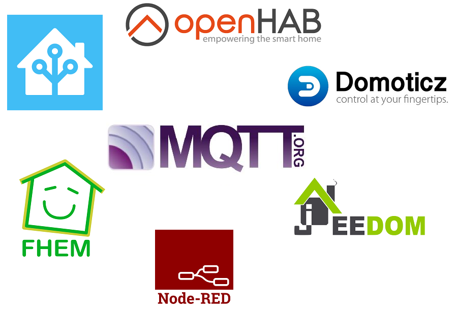

# MQTT integration (option)
## Broker
The broker will act as an intermediary between Theengs App and your [controller](/prerequisites/controller), it can be seen as a centralized hub at the heart of your automation system. It carry on messages following a publish / subscribe mechanism.

All the events or commands could pass by the broker.

There are many choices of brokers, here are some of the most popular:
* [Mosquitto](https://mosquitto.org/) (Open source)
* [Moquette](https://moquette-io.github.io/moquette/) (Open source)
* [HiveMQ](https://www.hivemq.com/hivemq/features/)
* Embedded MQTT brokers (Home Assistant and OpenHAB)

::: tip Note
MQTT broker should be installed on a local network or accessed through a VPN as Theengs app only support unencrypted connexion on port 1883 for now.
:::

This [wikipedia list](https://en.wikipedia.org/wiki/Comparison_of_MQTT_implementations) gives you more details about the different choices you have.
This [github list](https://github.com/mqtt/mqtt.github.io/wiki/libraries) seems to be the most exhaustive ones.
Here is also some [ideas of criteria](https://www.hivemq.com/blog/top-10-mqtt-broker-criteria/) from HiveMQ.

Once your broker is installed it can be interesting to see the traffic passing to it and to publish data, so as to do that there are several tools available:
* [MQTT Explorer](http://mqtt-explorer.com/)
* [HIVE MQ Web client](https://github.com/hivemq/hivemq-mqtt-web-client)
* [MQTT FX](https://mqttfx.jensd.de/)

MQTT enables you to connect easily a controller so as to monitor, control and automate scenarios.

## Controller
The following controllers (and many other software) are compatible with MQTT:

TheengsApp is independent from these projects, you have the liberty of choice among all the compatible software.

* [OpenHAB](https://www.openhab.org)
* [Home Assistant](https://www.home-assistant.io)
* [Domoticz](https://www.domoticz.com)
* [Jeedom](https://www.jeedom.com)
* [Node Red](https://nodered.org)
* [FHEM](https://fhem.de)
* [IO Broker](https://www.iobroker.net/)
