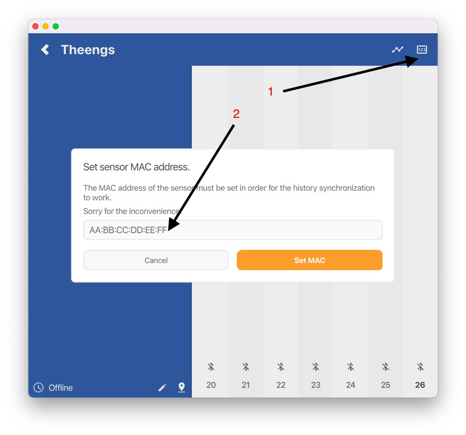
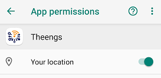
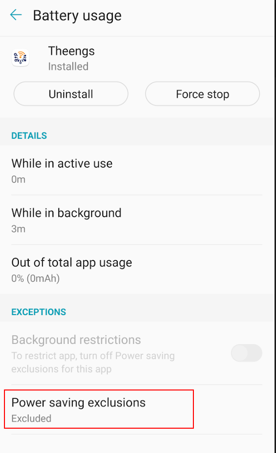
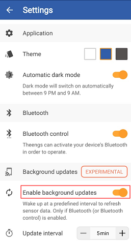
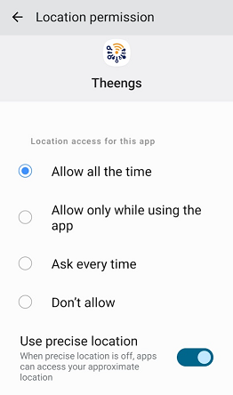
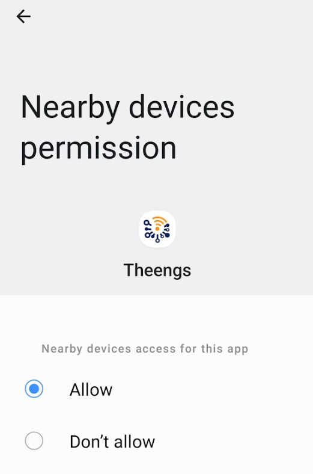
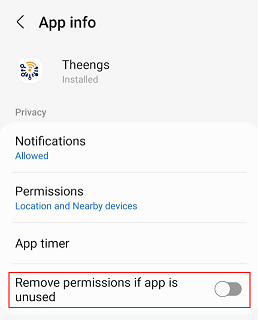
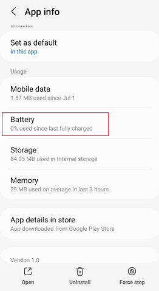
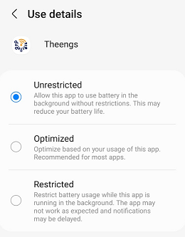
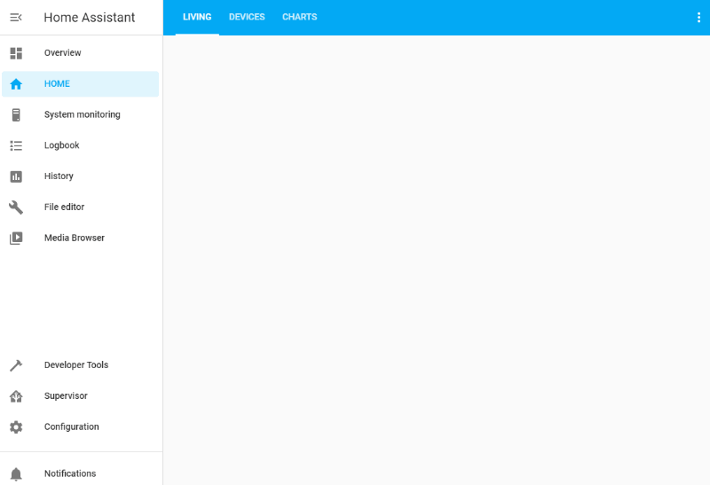

# Use

Features comparison between OS:
| OS | Real time data | MQTT integration | Running in background | Home Assistant Auto Discovery |
|:-:|:-:|:-:|:-:|:-:|
|iOS|☑️|☑️||☑️|
|Android|☑️|☑️|☑️ *experimental*|☑️|

## iOS

The application will ask you for permission to use Bluetooth. You can learn more on Apple [website](https://support.apple.com/HT210578).

If you want to push data to an MQTT broker you will need to enter manualy a MAC address for the sensor, this is done from the sensor page see below:



## Android

The Android operating system requires applications to ask for device location permission in order to scan for nearby Bluetooth Low Energy sensors.
You would need to go into the app information (long press on the icon -> (i)) so as to configure the app permissions properly.

### Android 8+
* Click on Permissions
* Activate "your location"



You can now use the application. If you want to run the application in the background follow the process below:
* Go back
* Click on "Battery"
* Click on "Power saving exclusions"
* Activate the exclusion for Theengs



* And finally go into the app settings and toggle "Enable background updates"



### Android 10+
#### Running when displayed only
* Click on Permissions
* Click on Location permission
* Select "Allow only while using the app", if you want the app to update sensors data only when the app is running at the front
* Enable "Use precise location" if you have this option

#### Running in the background (experimental)
If you want the app to retrieve data in the background you will need to do the following steps:
* Click on "Permissions"
* Click on "Location"
* Select "Allow all the time" if you want to update the sensors data in the background
* Enable "Use precise location" if you have this option



* Go back
* Click on "Nearby devices"
* Click on "Allow"



* Go back 2 times
* Deactivate "Remove permissions if app is unused"



* Click on battery



* Select unrestricted



* And finally go into the app settings and toggle "Enable background updates"


Some devices also require the GPS to be turned on while scanning for new sensors.

::: tip Note
Android has drastically reduced the capabilities of apps to run in the background, as a consequence the Update interval set into the app may not be followed by the operating system.
You may also have more regular results when the device is charging.
:::

## Home Assistant Auto Discovery

Theengs app can publish your sensor definition following Home Assistant MQTT convention, so as to do this you need to activate “Enable discovery” into your MQTT Options and follow the steps below:



The sensor definition will be publish when the app connect to the broker. You can retrigger the publication by deactivating and reactivating the MQTT integration from the application.

## Linux ('live mode' and 'historical data')

While reading Flower Care and RoPot historical entry count, the sensors usually freeze for up to a second, and the Linux kernel consider that to be a connection timeout.  
To be able to get the historical data working on Linux, you'll need to increase the "supervision timeout" value (while root):

```bash
# echo 100 > /sys/kernel/debug/bluetooth/hci0/supervision_timeout
```

You could also give Theengs binary the _net_raw_ and _net_admin_ capabilities, so that it could be allowed to changes the supervision timeout on its own. But at the moment that's not fully implemented.

```bash
# setcap 'cap_net_raw,cap_net_admin+eip' theengs
```