# Use

## Features comparison between Operating Systems
| OS | Real time data | BBQ monitoring | Battery monitors | SwitchBot control | MQTT integration (incl. TLS) | Running in background | Home Assistant Auto Discovery |
|:-:|:-:|:-:|:-:|:-:|:-:|:-:|:-:|
|iOS|☑️|☑️|☑️|☑️|☑️||☑️|
|Android|☑️|☑️|☑️|☑️|☑️|☑️ *(foreground service)*|☑️|

## Overview

<video width="353" height="628" controls>
  <source src="/videos/Theengs-app-demo.mp4" type="video/mp4">
  Your browser does not support the video tag.
</video>

## Real time data
The app enables to retrieve BLE sensor real time data, to add new sensors tap "Search for new sensors" in the hamburger menu.

To refresh the sensor data tap "Refresh sensor data" in the hamburger menu.

History charts on each device screen show the sampling interval used for the displayed data as a caption underneath the chart, so values from sparsely-broadcasting sensors can be interpreted at a glance.

::: tip Note
Why does Theengs App needs the location permission?

Theengs App requires the location permission to access your device Bluetooth and retrieves sensor data. Theengs is not accessing your location with GPS/GLONASS/BAIDU.
:::

## Live BBQ monitoring

### Introduction
Live BBQ Monitoring allows you to track the temperature of your grill in real time, ensuring perfect cooking results. The feature includes different Threshold Settings, a Live Chart, and Notifications for comprehensive monitoring.
This feature requires staying on the BBQ sensor screen to function effectively.

### Compatible devices
This feature is compatible with the following devices:
* Govee H5055
* Inkbird IBT-2X(S)
* Inkbird IBT-4X(S/C)
* Inkbird IBT-6X(S)
* SOLIS_6

### Threshold settings

Access the threshold settings from the hamburger menu.

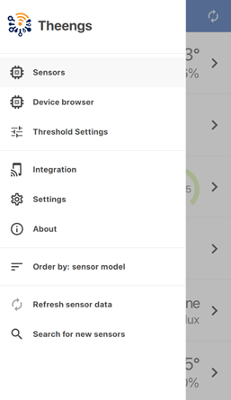

Select '+' to customize temperature ranges for different meats or cooking stages.

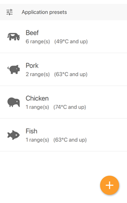

Name your preset for easy identification, e.g., 'Poultry', 'Rare Steak'.
Enter your desired temperature range. You can modify these presets anytime.

From the BBQ sensor view you can select the presets of your choice.

::: warning Warning
The cooking temperatures provided in this app are general recommendations. Variations in equipment, ingredients, and conditions can affect cooking outcomes.
Always verify food is cooked to safe temperatures.
The application developer is not liable for any cooking results.
:::

### Live monitoring
The Live Chart displays live temperature data from your BBQ sensor.
To view, tap on your BBQ device from the main screen.
The chart shows temperature changes over time, helping you monitor the cooking process.

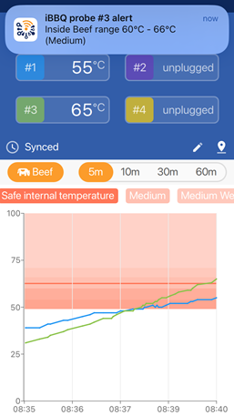

### Notifications
Enable notifications when prompted. Your phone must not be in silent or do not disturb mode.
Set temperature thresholds based on your meal. When the sensor detects temperatures beyond this range, you'll receive an alert.

::: tip Note
For continuous monitoring and notifications, you must keep the app open on the BBQ sensor screen.
Update frequency and real-time responsiveness depend on your smartphone’s processing capabilities, not the app. For best results, close unnecessary apps and ensure you are not far from the sensor.
:::

## Battery monitors

Theengs App supports a dedicated **Battery monitor** device class for 12 V lead-acid / LiFePO4 monitoring dongles:

* **BM2** — voltage broadcast on advertisement, plus connection-based history retrieval.
* **BM6** — voltage, temperature, and state-of-charge.

The battery-monitor screen shows the live voltage with a 0–20 V scale, a rolling chart, and configurable **battery presets** (chemistry / nominal voltage / warning thresholds) reachable from the hamburger menu — similar to BBQ threshold presets.

::: tip Note
On iOS the BM6 requires a one-time detection handshake. The app handles this automatically the first time the device is added; just keep the dongle in range.
:::

## SwitchBot control

Beyond reading sensors, Theengs App can **control** several SwitchBot actuators over BLE. Control is connection-based: the app pairs to the device on demand, sends the action, then releases the link.

### Supported SwitchBot devices

| Device | Model ID | Actions |
|---|---|---|
| SwitchBot Bot S1 / SmartSwitch | `SBS1` (alias `X1`) | On, Off, Push-Pull, with selectable **Press** / **Switch** mode, inverted-direction toggle, and configurable press duration |
| SwitchBot Curtain 2 / Curtain 3 | `SBCU` (alias `W070160X`) | Open, Close, Stop, move to position (0–100 %), High / Low speed |
| SwitchBot Blind Tilt | `SBBT` (alias `W270160X`) | Open, Close up, Close down, Stop, tilt to position (-100…100 %) |

### How to use

1. Wake the device once (press the button on the Bot, or the sync button under the Curtain / Blind Tilt) so it advertises.
2. In Theengs App, **Search for new sensors** — the SwitchBot device appears as an actuator with a dedicated screen.
3. Tap the device tile to open the control screen and use the dedicated buttons or position slider.

The Bot S1 lets you switch between **Press** mode (one-shot push) and **Switch** mode (latching on/off) from the same screen, and supports an *invert direction* toggle if your physical setup expects the opposite movement.

::: tip Note
Each control requires a brief BLE connection to the SwitchBot device, so the action may take a second or two. Battery level is read back from advertisements when available.
:::

## MQTT integration

Prerequisites:
* MQTT broker setup in your local network (Mosquitto is a well known broker)

Theengs app can publish the data to an MQTT broker, to do so go to the hamburger menu, select Integration.
Enter the following informations:
* Broker host IP (compulsory)
* Broker port (compulsory, default: `1883`)
* Username (optional)
* Password (optional)
* Topic (compulsory, default: `home`)
* SubTopic (compulsory, default: `TheengsApp`)

Once done click on the MQTT switch to activate the integration, if the app can connect to the broker, it will display "Connected" in the top right.

<video width="353" height="767" controls>
  <source src="/videos/Theengs-App-mqtt-integration.mp4" type="video/mp4">
  Your browser does not support the video tag.
</video>

### TLS-encrypted brokers

Theengs app can connect to MQTT brokers over TLS, including HiveMQ Cloud and other public-CA brokers as well as private brokers with self-signed certificates. From the Integration screen, in the **Options** section:

* Toggle **Use TLS** on. The default port `1883` is plaintext — TLS brokers usually listen on port `8883`, the app shows an inline hint to change it when needed.
* For brokers using a public CA (HiveMQ Cloud, AWS IoT, etc.) leave the **Custom CA certificate** field empty — the system root CA store is used automatically.
* For private / self-signed brokers, tap the folder icon in the **Custom CA certificate** field to browse and pick a CA `.pem` (or `.crt`/`.cer`/`.der`) file from Files / iCloud Drive (iOS) or local storage (Android/desktop).
* If the broker uses a self-signed cert that doesn't match its hostname and you trust the network, toggle **Skip validation** on. A red warning is shown when this is enabled — only use it with brokers you control. Tap the (i) icon next to the toggle to collapse the warning once acked.

The bottom **Activity** panel shows timestamped status changes and TLS handshake errors so you can diagnose connection problems. The buffer is capped at the 100 most-recent entries.

### iOS specificity

If you want to push data to an MQTT broker you will need to manually enter a MAC address for the sensor, this is done from the sensor page see below:

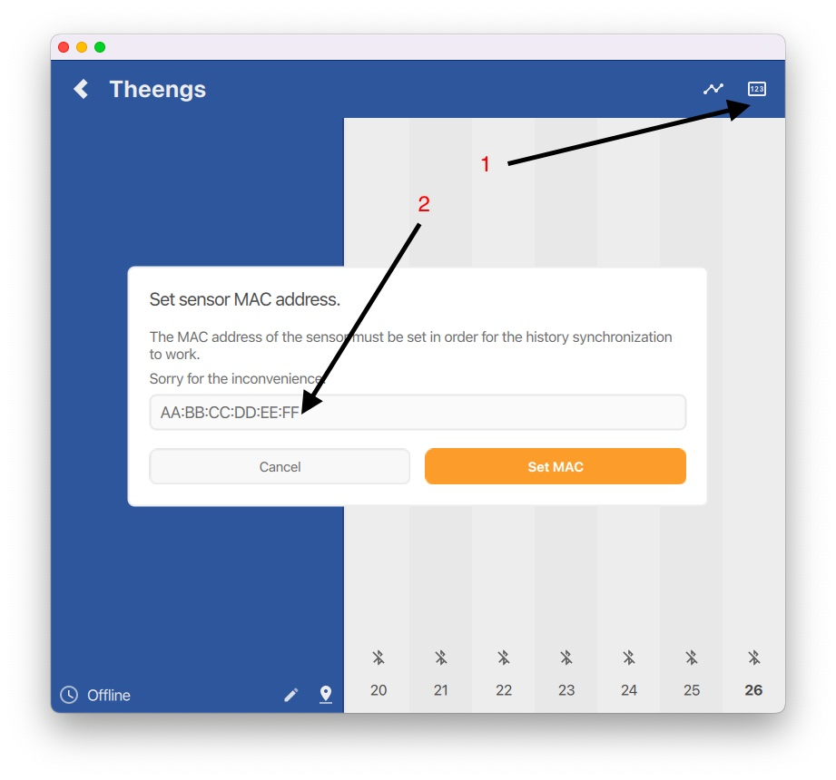

### Home Assistant Auto Discovery

Theengs app can publish your sensor definition following Home Assistant MQTT convention, so as to do this you need to activate “Enable discovery” into your MQTT Options and follow the steps below:

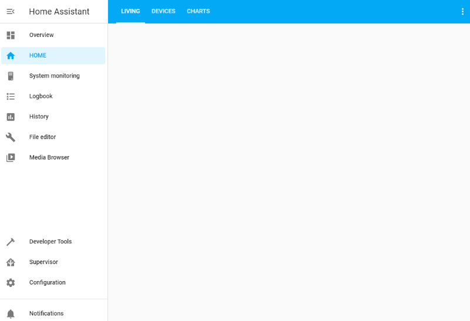

The sensor definition will be publish when the app connect to the broker. You can retrigger the publication by deactivating and reactivating the MQTT integration from the application.

## iOS permissions

The application will ask you for permission to use Bluetooth. You can learn more on Apple [website](https://support.apple.com/HT210578).

## Android permissions

The Android operating system requires applications to ask for device location permission in order to scan for nearby Bluetooth Low Energy sensors.
You would need to go into the app information (long press on the icon -> (i)) so as to configure the app permissions properly.

### Android 8+
* Click on Permissions
* Activate "your location"

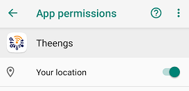

You can now use the application. If you want to run the application in the background follow the process below:
* Go back
* Click on "Battery"
* Click on "Power saving exclusions"
* Activate the exclusion for Theengs

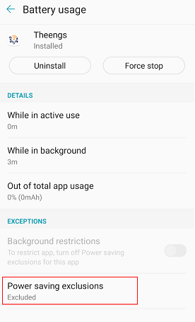

* And finally go into the app settings and toggle "Enable background updates"

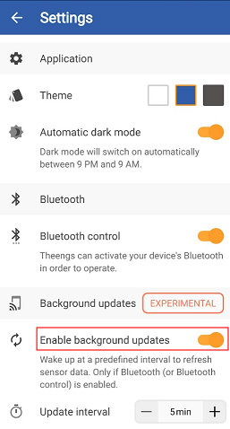

### Android 10+
#### Running when displayed only
* Click on Permissions
* Click on Location permission
* Select "Allow only while using the app", if you want the app to update sensors data only when the app is running at the front
* Enable "Use precise location" if you have this option

#### Running in the background (foreground service)

To keep scanning when the screen is off, Theengs App starts a **foreground BLE-scan service** with a persistent notification. The notification doubles as a live status panel: it shows the most recent reading and, if MQTT is enabled, the connection state and a drop counter when publishes fail.

To enable it:

* Click on "Permissions"
* Click on "Location" → "Allow all the time", and enable "Use precise location"

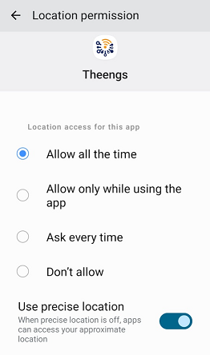

* Go back, click on "Nearby devices" → "Allow"

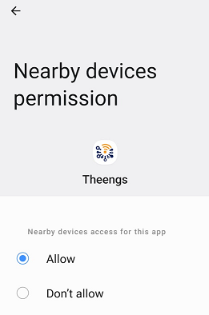

* On first launch the app will request the **Notifications** permission — accept it; the foreground service relies on the persistent notification being visible.
* Go back twice and deactivate "Remove permissions if app is unused"

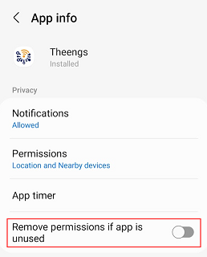

* Click on battery

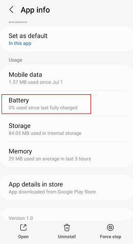

* Select unrestricted

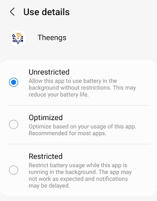

* Finally, in the app settings, toggle "Enable background updates"

Some devices also require the GPS to be turned on while scanning for new sensors.

::: tip Note
Even with the foreground service, Android may still throttle scanning when the device is in deep doze. Results are most consistent when the phone is charging or the screen is on. The notification is required by Android for any long-running BLE foreground task; dismissing it stops the background scan.
:::
