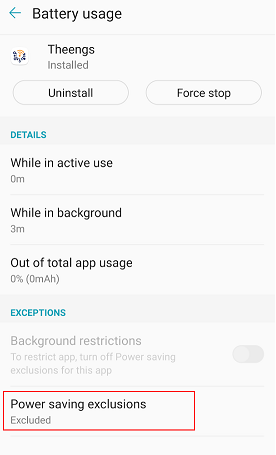

# Use

## Features comparison between OS
| OS | Real time data | MQTT integration | Running in background | Home Assistant Auto Discovery |
|:-:|:-:|:-:|:-:|:-:|
|iOS|☑️|☑️||☑️|
|Android|☑️|☑️|☑️ *experimental*|☑️|

## Overview

<iframe width="353" height="628" src="/videos/Theengs-app-demo.mp4" frameborder="0" type="video/mp4" allowfullscreen></iframe>

## Real time data
The app enables to retrieve BLE sensor real time data, to add new sensors tap "Search for new sensors" in the hamburger menu.

To refresh the sensor data tap "Refresh sensor data" in the hamburger menu.

::: tip Note
Why does Theengs App needs the location permission?

Theengs App requires the location permission to access your device Bluetooth and retrieves sensor data. Theengs is not accessing your location with GPS/GLONASS/BAIDU.
:::

## MQTT integration

Prerequisites:
* MQTT broker setup in your local network (Mosquitto is a well known broker)

Theengs app can publish the data to an MQTT broker, to do so go to the hamburger menu, select Integration.
Enter the following informations:
* Broker host IP (compulsory)
* Broker port (compulsory, default: `1883`)
* Username (optional)
* Password (optional)
* Topic (compulsory, default: `home`)
* SubTopic (compulsory, default: `TheengsApp`)

Once done click on the MQTT switch to activate the integration, if the app can connect to the broker, it will display "Connected" in the top right.

<iframe width="353" height="767" src="/videos/Theengs-App-mqtt-integration.mp4" frameborder="0" type="video/mp4" allowfullscreen></iframe>

### iOS specificity

If you want to push data to an MQTT broker you will need to manually enter a MAC address for the sensor, this is done from the sensor page see below:

### Home Assistant Auto Discovery

Theengs app can publish your sensor definition following Home Assistant MQTT convention, so as to do this you need to activate “Enable discovery” into your MQTT Options and follow the steps below:

The sensor definition will be publish when the app connect to the broker. You can retrigger the publication by deactivating and reactivating the MQTT integration from the application.

## iOS permissions

The application will ask you for permission to use Bluetooth. You can learn more on Apple [website](https://support.apple.com/HT210578).

## Android permissions

The Android operating system requires applications to ask for device location permission in order to scan for nearby Bluetooth Low Energy sensors.
You would need to go into the app information (long press on the icon -> (i)) so as to configure the app permissions properly.

### Android 8+
* Click on Permissions
* Activate "your location"

You can now use the application. If you want to run the application in the background follow the process below:
* Go back
* Click on "Battery"
* Click on "Power saving exclusions"
* Activate the exclusion for Theengs

* And finally go into the app settings and toggle "Enable background updates"

### Android 10+
#### Running when displayed only
* Click on Permissions
* Click on Location permission
* Select "Allow only while using the app", if you want the app to update sensors data only when the app is running at the front
* Enable "Use precise location" if you have this option

#### Running in the background (experimental)
If you want the app to retrieve data in the background you will need to do the following steps:
* Click on "Permissions"
* Click on "Location"
* Select "Allow all the time" if you want to update the sensors data in the background
* Enable "Use precise location" if you have this option

* Go back
* Click on "Nearby devices"
* Click on "Allow"

* Go back 2 times
* Deactivate "Remove permissions if app is unused"

* Click on battery

* Select unrestricted

* And finally go into the app settings and toggle "Enable background updates"

Some devices also require the GPS to be turned on while scanning for new sensors.

::: tip Note
Android has drastically reduced the capabilities of apps to run in the background, as a consequence the Update interval set into the app may not be followed by the operating system.
You may also have more regular results when the device is charging.
:::
